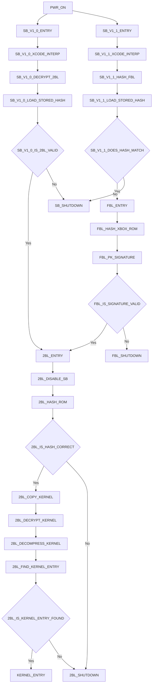

```mermaid
graph TD;

PWR_ON-->SB_V1_0_ENTRY
SB_V1_0_ENTRY-->SB_V1_0_XCODE_INTERP
SB_V1_0_XCODE_INTERP-->SB_V1_0_DECRYPT_2BL

SB_V1_0_DECRYPT_2BL-->SB_V1_0_LOAD_STORED_HASH
SB_V1_0_LOAD_STORED_HASH-->SB_V1_0_IS_2BL_VALID{SB_V1_0_IS_2BL_VALID}
SB_V1_0_IS_2BL_VALID-->|Yes|2BL_ENTRY
SB_V1_0_IS_2BL_VALID-->|No|SB_SHUTDOWN

PWR_ON-->SB_V1_1_ENTRY
SB_V1_1_ENTRY-->SB_V1_1_XCODE_INTERP
SB_V1_1_XCODE_INTERP-->SB_V1_1_HASH_FBL
SB_V1_1_HASH_FBL-->SB_V1_1_LOAD_STORED_HASH
SB_V1_1_LOAD_STORED_HASH-->SB_V1_1_DOES_HASH_MATCH{SB_V1_1_DOES_HASH_MATCH}

SB_V1_1_DOES_HASH_MATCH-->|Yes|FBL_ENTRY
SB_V1_1_DOES_HASH_MATCH-->|No|SB_SHUTDOWN

FBL_ENTRY-->FBL_HASH_XBOX_ROM
FBL_HASH_XBOX_ROM-->FBL_PK_SIGNATURE

FBL_PK_SIGNATURE-->FBL_IS_SIGNATURE_VALID{FBL_IS_SIGNATURE_VALID}
FBL_IS_SIGNATURE_VALID-->|Yes|2BL_ENTRY
FBL_IS_SIGNATURE_VALID-->|No|FBL_SHUTDOWN

2BL_ENTRY-->2BL_DISABLE_SB
2BL_DISABLE_SB-->2BL_HASH_ROM

2BL_HASH_ROM-->2BL_IS_HASH_CORRECT{2BL_IS_HASH_CORRECT}
2BL_IS_HASH_CORRECT-->|Yes|2BL_COPY_KERNEL
2BL_IS_HASH_CORRECT-->|No|2BL_SHUTDOWN

2BL_COPY_KERNEL-->2BL_DECRYPT_KERNEL
2BL_DECRYPT_KERNEL-->2BL_DECOMPRESS_KERNEL
2BL_DECOMPRESS_KERNEL-->2BL_FIND_KERNEL_ENTRY
2BL_FIND_KERNEL_ENTRY-->2BL_IS_KERNEL_ENTRY_FOUND{2BL_IS_KERNEL_ENTRY_FOUND}

2BL_IS_KERNEL_ENTRY_FOUND-->|Yes|KERNEL_ENTRY
2BL_IS_KERNEL_ENTRY_FOUND-->|No|2BL_SHUTDOWN

```
