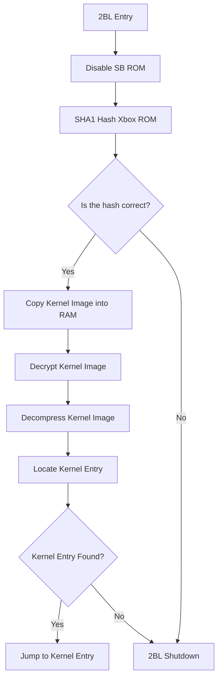

```mermaid
graph TD;

2BL_ENTRY[2BL Entry]-->2BL_DISABLE_SB
2BL_DISABLE_SB[Disable SB ROM]-->2BL_HASH_ROM

2BL_HASH_ROM[SHA1 Hash Xbox ROM]-->2BL_IS_HASH_CORRECT{Is the hash correct?}
2BL_IS_HASH_CORRECT-->|Yes|2BL_COPY_KERNEL
2BL_IS_HASH_CORRECT-->|No|2BL_SHUTDOWN

2BL_COPY_KERNEL[Copy Kernel Image into RAM]-->2BL_DECRYPT_KERNEL
2BL_DECRYPT_KERNEL[Decrypt Kernel Image]-->2BL_DECOMPRESS_KERNEL
2BL_DECOMPRESS_KERNEL[Decompress Kernel Image]-->2BL_FIND_KERNEL_ENTRY

2BL_FIND_KERNEL_ENTRY[Locate Kernel Entry]-->2BL_IS_KERNEL_ENTRY_FOUND{Kernel Entry Found?}
2BL_IS_KERNEL_ENTRY_FOUND-->|Yes|KERNEL_ENTRY
2BL_IS_KERNEL_ENTRY_FOUND-->|No|2BL_SHUTDOWN

2BL_SHUTDOWN[2BL Shutdown]
KERNEL_ENTRY[Jump to Kernel Entry]

```
