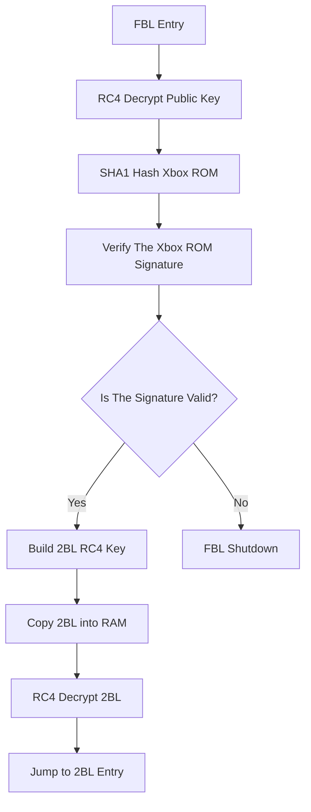

```mermaid
graph TD;

FBL_ENTRY[FBL Entry]-->DECRYPT_PK
DECRYPT_PK[RC4 Decrypt Public Key]-->HASH_XBOX_ROM
HASH_XBOX_ROM[SHA1 Hash Xbox ROM]-->PK_SIGNATURE

PK_SIGNATURE[Verify The Xbox ROM Signature]-->IS_SIGNATURE_VALID{Is The Signature Valid?}
IS_SIGNATURE_VALID-->|Yes|BLD_2BL_KEY
IS_SIGNATURE_VALID-->|No|SHUTDOWN

BLD_2BL_KEY[Build 2BL RC4 Key]-->COPY_2BL
COPY_2BL[Copy 2BL into RAM]-->DECRYPT_2BL
DECRYPT_2BL[RC4 Decrypt 2BL]-->2BL_ENTRY

SHUTDOWN[FBL Shutdown]
2BL_ENTRY[Jump to 2BL Entry]

```
