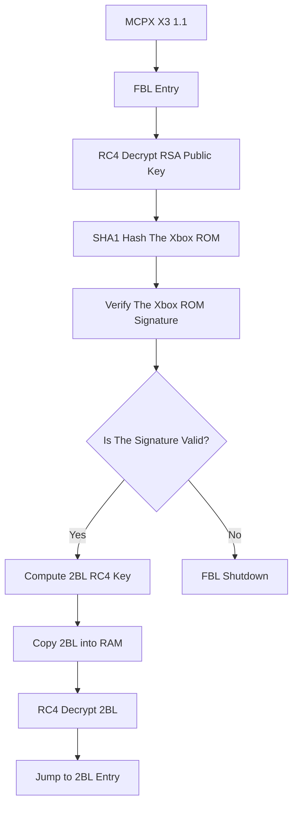

## FBL

```mermaid
flowchart TB

MCPX_REV1[MCPX X3 1.1]-->FBL_ENTRY

FBL_ENTRY[FBL Entry]-->DECRYPT_PK
DECRYPT_PK[RC4 Decrypt RSA Public Key]-->HASH_XBOX_ROM
HASH_XBOX_ROM[SHA1 Hash The Xbox ROM]-->PK_SIGNATURE

PK_SIGNATURE[Verify The Xbox ROM Signature]-->IS_SIGNATURE_VALID{Is The Signature Valid?}
IS_SIGNATURE_VALID-->|Yes|BLD_2BL_KEY
IS_SIGNATURE_VALID-->|No|SHUTDOWN

BLD_2BL_KEY[Compute 2BL RC4 Key]-->COPY_2BL
COPY_2BL[Copy 2BL into RAM]-->DECRYPT_2BL
DECRYPT_2BL[RC4 Decrypt 2BL]-->2BL_ENTRY

SHUTDOWN[FBL Shutdown]
2BL_ENTRY[Jump to 2BL Entry]

click 2BL_ENTRY "https://github.com/tommojphillips/XboxBiosTool/blob/master/boot_state_diagram_2bl.md"
click MCPX_REV1 "https://github.com/tommojphillips/XboxBiosTool/blob/master/boot_state_diagram_mcpx_rev1.md"

```
