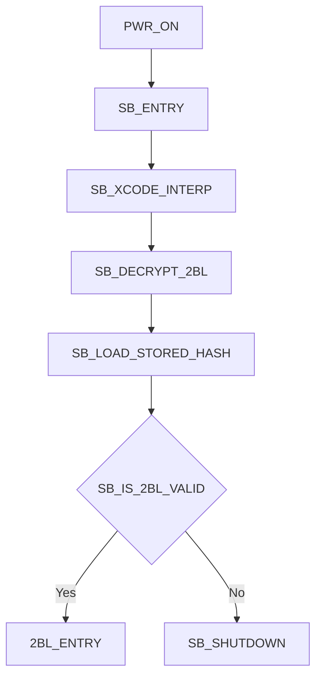

```mermaid
graph TD;

PWR_ON-->SB_ENTRY
SB_ENTRY-->SB_XCODE_INTERP
SB_XCODE_INTERP-->SB_DECRYPT_2BL

SB_DECRYPT_2BL-->SB_LOAD_STORED_HASH
SB_LOAD_STORED_HASH-->SB_IS_2BL_VALID{SB_IS_2BL_VALID}
SB_IS_2BL_VALID-->|Yes|2BL_ENTRY
SB_IS_2BL_VALID-->|No|SB_SHUTDOWN

```
