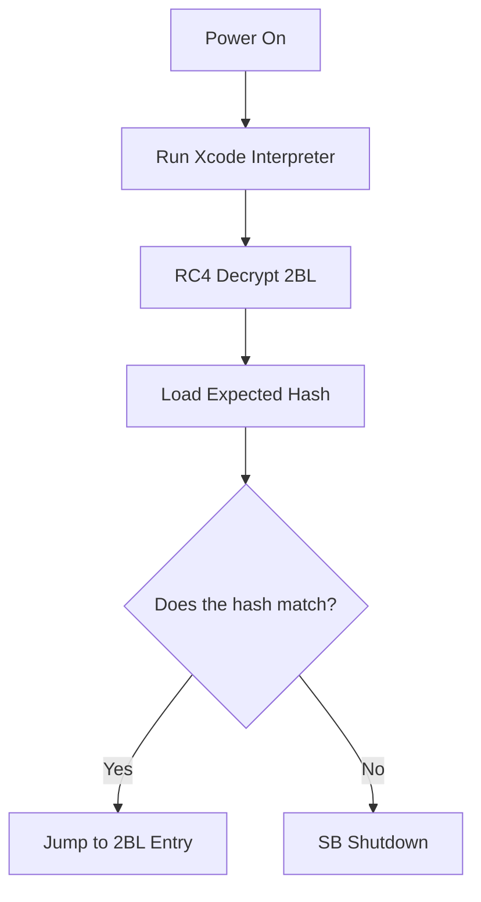

```mermaid
graph TD;

PWR_ON[Power On]-->SB_XCODE_INTERP
SB_XCODE_INTERP[Run Xcode Interpreter]-->SB_DECRYPT_2BL

SB_DECRYPT_2BL[RC4 Decrypt 2BL]-->SB_LOAD_STORED_HASH
SB_LOAD_STORED_HASH[Load Expected Hash]-->SB_IS_2BL_VALID{Does the hash match?}
SB_IS_2BL_VALID-->|Yes|2BL_ENTRY
SB_IS_2BL_VALID-->|No|SB_SHUTDOWN

2BL_ENTRY[Jump to 2BL Entry]
SB_SHUTDOWN[SB Shutdown]
```

- [MCPX V1.1](boot_state_diagram_mcpx_rev1.md)
- [FBL](boot_state_diagram_fbl.md)
- [2BL](boot_state_diagram_2bl.md)
