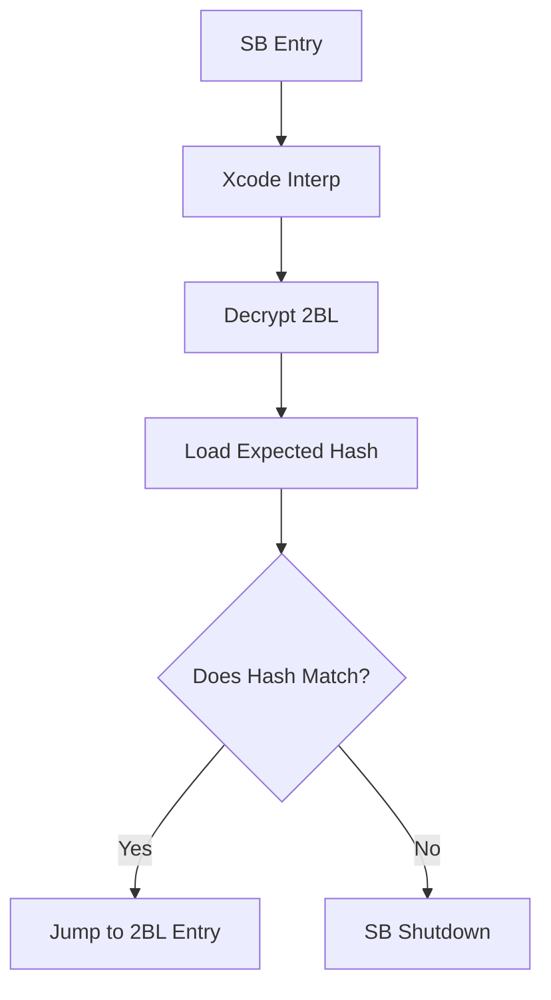

```mermaid
graph TD;

SB_ENTRY[SB Entry]-->SB_XCODE_INTERP
SB_XCODE_INTERP[Xcode Interp]-->SB_DECRYPT_2BL

SB_DECRYPT_2BL[Decrypt 2BL]-->SB_LOAD_STORED_HASH
SB_LOAD_STORED_HASH[Load Expected Hash]-->SB_IS_2BL_VALID{Does Hash Match?}
SB_IS_2BL_VALID-->|Yes|2BL_ENTRY
SB_IS_2BL_VALID-->|No|SB_SHUTDOWN

2BL_ENTRY[Jump to 2BL Entry]
SB_SHUTDOWN[SB Shutdown]
```
