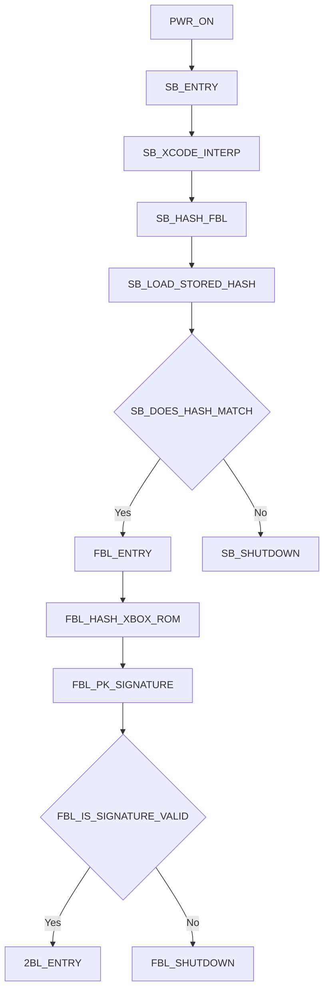

```mermaid
graph TD;

PWR_ON-->SB_ENTRY
SB_ENTRY-->SB_XCODE_INTERP
SB_XCODE_INTERP-->SB_HASH_FBL
SB_HASH_FBL-->SB_LOAD_STORED_HASH
SB_LOAD_STORED_HASH-->SB_DOES_HASH_MATCH{SB_DOES_HASH_MATCH}

SB_DOES_HASH_MATCH-->|Yes|FBL_ENTRY
SB_DOES_HASH_MATCH-->|No|SB_SHUTDOWN

FBL_ENTRY-->FBL_HASH_XBOX_ROM
FBL_HASH_XBOX_ROM-->FBL_PK_SIGNATURE

FBL_PK_SIGNATURE-->FBL_IS_SIGNATURE_VALID{FBL_IS_SIGNATURE_VALID}
FBL_IS_SIGNATURE_VALID-->|Yes|2BL_ENTRY
FBL_IS_SIGNATURE_VALID-->|No|FBL_SHUTDOWN

```
