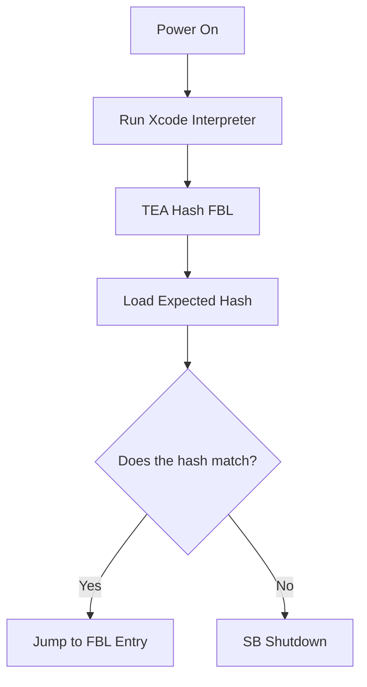

```mermaid
graph TD;

PWR_ON[Power On]-->SB_XCODE_INTERP
SB_XCODE_INTERP[Run Xcode Interpreter]-->SB_HASH_FBL
SB_HASH_FBL[TEA Hash FBL]-->SB_LOAD_STORED_HASH
SB_LOAD_STORED_HASH[Load Expected Hash]-->SB_DOES_HASH_MATCH{Does the hash match?}

SB_DOES_HASH_MATCH-->|Yes|FBL_ENTRY
SB_DOES_HASH_MATCH-->|No|SB_SHUTDOWN

SB_SHUTDOWN[SB Shutdown]
FBL_ENTRY[Jump to FBL Entry]

```
