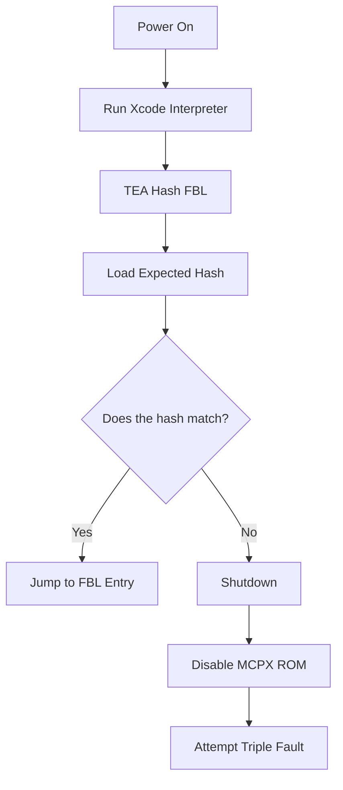

## MCPX X3 1.1

```mermaid
flowchart TB

PWR_ON[Power On]-->SB_XCODE_INTERP
SB_XCODE_INTERP[Run Xcode Interpreter]-->SB_HASH_FBL
SB_HASH_FBL[TEA Hash FBL]-->SB_LOAD_STORED_HASH
SB_LOAD_STORED_HASH[Load Expected Hash]-->SB_DOES_HASH_MATCH{Does the hash match?}

SB_DOES_HASH_MATCH-->|Yes|FBL_ENTRY
SB_DOES_HASH_MATCH-->|No|SB_SHUTDOWN

SB_SHUTDOWN[Shutdown]-->DISABLE_SB_ROM
FBL_ENTRY[Jump to FBL Entry]

DISABLE_SB_ROM[Disable MCPX ROM]-->ATTEMPT_TRIPLE_FAULT
ATTEMPT_TRIPLE_FAULT[Attempt Triple Fault]

click FBL_ENTRY "https://github.com/tommojphillips/XboxBiosTool/blob/master/boot_state_diagram_fbl.md"
```

- [MCPX V1.0](boot_state_diagram_mcpx_rev0.md)
